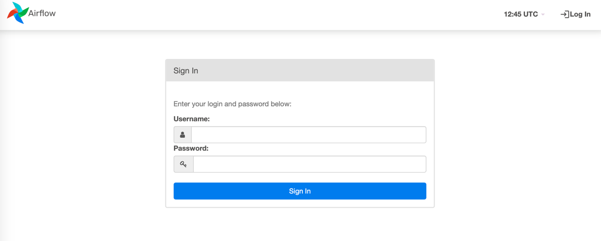
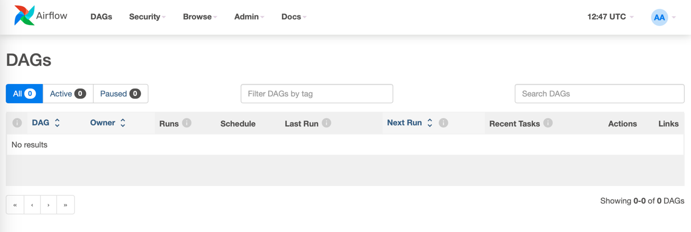

# Airflow
Туториал по запуску airflow в docker для выполнения домашнего задания:
### Структура репозитория
    .
    ├── dags                   # Директория с вашими дагами (пайплайнами)
    ├── logs                   # Директория с логами ваших дагов
    ├── plugins                # Директория для дагов
    ├── images                 # Образы для контейнеров
    ├── db.env                 # Перемнные окружения для БД
    ├── .env                   # Переменные окружения
    ├── docker-compose.yaml    # Описание контейнеров для запуска
    └── readme.md

## Запуск
Прежде всего у вас должен быть установлен docker: https://docs.docker.com/get-docker/

### Linux and Macos
1) Клонируем репозиторий на локальный компьютер
```
git clone 
```
2) Переходим в папку, которую скопировали
```
cd airflow_in_docekr_tutorial
```
3) Собиарем контейнеры
```
docker compose up -d
```
Ждём пока запустится (несколько минут). Если всё успешно, то выполнив команду docker ps, будет следующий вывод (практически везде будет "healthy", если там "health: starting", то нужно подождать):
```docker ps
CONTAINER ID   IMAGE                                          COMMAND                  CREATED         STATUS                   PORTS                    NAMES
d8f86987157b   airflow_in_docker_tutorial-airflow-webserver   "/usr/bin/dumb-init …"   5 minutes ago   Up 4 minutes (healthy)   0.0.0.0:8080->8080/tcp   airflow_in_docker_tutorial-airflow-webserver-1
f769b2c413cb   airflow_in_docker_tutorial-airflow-triggerer   "/usr/bin/dumb-init …"   5 minutes ago   Up 4 minutes (healthy)   8080/tcp                 airflow_in_docker_tutorial-airflow-triggerer-1
1c3ee1720df1   airflow_in_docker_tutorial-airflow-worker      "/usr/bin/dumb-init …"   5 minutes ago   Up 4 minutes (healthy)   8080/tcp                 airflow_in_docker_tutorial-airflow-worker-1
c87357e62f45   airflow_in_docker_tutorial-airflow-scheduler   "/usr/bin/dumb-init …"   5 minutes ago   Up 4 minutes (healthy)   8080/tcp                 airflow_in_docker_tutorial-airflow-scheduler-1
922b924b36c6   bobrik/socat                                   "socat TCP4-LISTEN:2…"   5 minutes ago   Up 5 minutes             0.0.0.0:2376->2375/tcp   airflow_in_docker_tutorial-docker-proxy-1
2932728bfb41   redis:latest                                   "docker-entrypoint.s…"   5 minutes ago   Up 5 minutes (healthy)   6379/tcp                 airflow_in_docker_tutorial-redis-1
7a848bde91d7   postgres:13                                    "docker-entrypoint.s…"   5 minutes ago   Up 5 minutes (healthy)   5432/tcp                 airflow_in_docker_tutorial-postgres-1
```
4) В браузере переходим по ссылке http://localhost:8080. Вам будет доступен UI Airflow, где можно посмотреть все ваши даги.

логин: airlfow  
пароль: airflow  
После успешного логина появится страница с dag:

5) Чтобы добавить dag создаём в папке airflow_in_docekr_tutorial/dags/ новый файл my_first_dag.py
```
touch dags/my_firts_dag.py
```
Все .py файлы из этой директории Airflow считывает и анализирует, чтобы добавить в расписание. И данных dag появляется в UI (по умолчанию он выключен).

Все требуемые для анализа файлы можно положить туда же (для тестов).

## Настройка
Конфиги вынесены в файл .env
Например логин и пароль:
```
_AIRFLOW_WWW_USER_USERNAME=airflow
_AIRFLOW_WWW_USER_PASSWORD=airflow
```
Или старт дагов по умолчанию:
``
AIRFLOW__CORE__DAGS_ARE_PAUSED_AT_CREATION='True'
``  
Если нужны дополнительные python библиотеки, то их нужно пропиcать в images/airflow/requirements.txt и пересобрать контейнер.